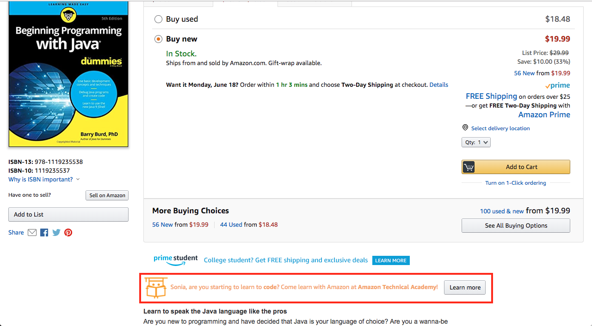
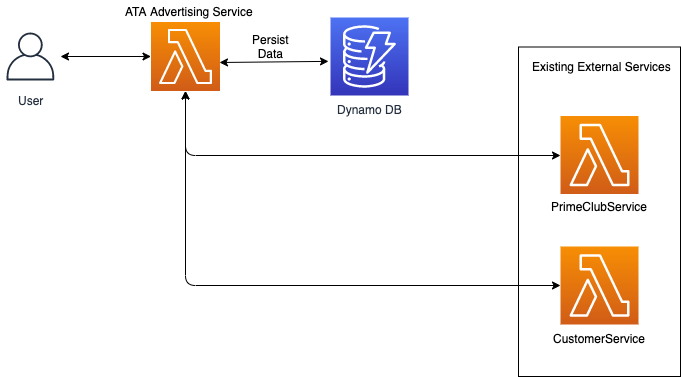

# ATA Advertising Service Design 

## Background

ATA's AdvertisingService serves advertisements for ATA. These advertisements show up on the retail website and use 
targeting to present different ATA advertisements to each individual. The targeting tries to take advantage of what 
Amazon knows about you to show you the particular ad that is most likely to appeal to you.

Below is an example of what an ATA advertisement could look like for a customer on a product detail page:



*Figure 1: A product detail page for the book Beginning Programming with Java. On the detail page is 
an advertisement that says “Sonia, are you learning to code? Come learn with Amazon at Amazon Technical Academy!” and 
has a “Learn more” button.*

## Glossary

* **content**: Refers to html of the ATA advertising content that is rendered and displayed to customers. Each content 
has one or more targeting groups assigned to it defining who can view this piece of content.
   * example: `<div class="ata-ad">Need a New Career? Become a Software Developer, join ATA! <a href="https://w.amazon.com/bin/view/Amazon_Technical_Academy/">Learn more</a></div>` 
* **targeting group**: a collection of targeting predicates and a click through rate associated with advertising 
content. Every targeting predicate within a targeting group is AND'd together. Each piece of advertising content can 
have multiple targeting groups. An example targeting group could be customers who are between ages 22-25 AND who have 
spent over $20 in the technical books category AND are a parent.
* **targeting predicate**: a single rule that a customer must match to be included in the targeting group. An example 
could be customers who have spent over $20 in the technical books category.
* **click though rate (CTR)**: The rate at which customers in a specific targeting group who sees an ad will click on it. 
The values are from 0 to 1 inclusive. For example, if a targeting has a click through rate of 0.2, that means that 20%
of people who are in this targeting group and see this advertisement clicks the advertisement. Click through rates are
generally low, because most people don't click on advertisements at all.
* **PrimeClubService**: an external service used to retrieve a customer's Prime benefits.
* **CustomerService**: an external service used to retrieve customer profile information and spending habits.
* **MarketplaceID**: a unique identifier of a marketplace. A marketplaceID can be in the obfuscated or unobfuscated 
format. For example, for the US marketplace, the obfuscated marketplaceID is `ATVPDKIKX0DER` and the unobfuscated 
marketplaceId is `1`. See [wiki](https://w.amazon.com/bin/view/MarketplaceID/) for more details.

## Use Cases

* As an ATA business owner, I want to create ATA advertising content that targets specific groups of customers.
* As an ATA business owner, I want to be able to update existing advertising content .
* As an ATA business owner, I want to be able to add a new targeting group to an existing piece of advertising content.
* As an ATA business owner, I want to generate an advertisement for a customer based on the existing advertising content.
* As an ATA business owner, I want to update an advertisement's click through rate for a targeting group. 

## Advertising Service Implementation Notes

A piece of content can have multiple targeting groups. For example, we can have a specific advertisement that is 
displayed for customers who have spent at least $15 in the technical books category, but no more than $100 ***OR*** 
customers who have spent at least $15 on logic books. Every targeting rule within a targeting group is AND'd together. 
To reach customers that meet one criteria *or *another, we have to use multiple targeting groups.

The click through rate tells us the probability that someone who sees this ad will click on it (values are from 0 to 1 
inclusively). We separate click through rate by targeting group, because this advertisement may be incredibly popular 
with customers who have bought technical books (30% chance they will click on the ad), but less popular with the logic 
book group (only a 15% chance they will click on the ad).

To evaluate these targeting rules, we often have to call other services to get data like the PrimeClubService to find 
out a customer's Prime benefits, or the CustomerService to get profile information and spending habits for the customer. 

If, for a given customer, there is no eligible advertisement, we will return an empty ad. If any exception occurs when 
calling to generate the ad, we do not want to throw an exception that will bubble up when rendering a detail page, so 
instead we return an empty ad i.e. an empty string.


## High Level Architecture

This is the architecture of what things will look like at the end of the project. Since this is a high level 
architecture diagram, it does not include more granular details such as the service client that the user would use to 
connect to ATA Advertising Service or Amazon API Gateway used to route requests to/from 
the Lambda services.



*Figure 2: Diagram showing the high level architecture of ATA Advertising 
Service. A user connects to the advertising service. The Advertising Service connects to DynamoDB for persisting 
advertising information and connects to existing external services 
PrimeClubService and CustomerService.*


## API

### Public Models

The public models represent an interface with the user. These names should be recognizable to the users.
This section includes data structures that are used in lists and as members in API requests or responses. The actual 
request and response details are listed separately, with each endpoint.

**AdvertisingContent**

Advertising content to be displayed in the given marketplace.

```
id // identifier for advertising content
marketplaceId // marketplace to display the add
content // the html/css content to be rendered
```

**TargetingPredicate**

 A predicate, or rule, to target the audience of a piece of content. A customer must meet the criteria of this 
 targeting predicate for it to evaluate to true. If it is not possible to determine if a customer meets this 
 criteria, the predicate will evaluate to indeterminate.

```
targetingPredicateType // type of rule, e.g. AGE, CATEGORY_SPEND_FREQUENCY
negate // whether to use the inverse of the given rule
attributes // targeting predicate attributes
```

**TargetingPredicateType**

Enum representing type associated with a targeting predicate.

```
AGE
CATEGORY_SPEND_FREQUENCY
CATEGORY_SPEND_VALUE
PARENT
PRIME_BENEFIT
RECOGNIZED
```

**TargetingGroup**

A group of `TargetingPredicates` that determines the group of customers that are being targeted for an 
 advertisement. One piece of content can have multiple targeting groups associated with it. Since different 
 groups of customers behave different ways, the click through rate is measured for the particular targeting group 
 and not the overall content.

```
targetingGroupId // unique identifier of the targeting group
contentId // id of the advertising content this targeting group is associated with
clickThroughRate // the rate that customers who see the add click on it (between 0 and 1)
targetingPredicates // the targeting rules for this group 
```

##CreateContent

Creates a new piece of advertising content and a targeting group to go with it. The html/css content of the advertisement 
and a marketplace to schedule the content in is required. If a list of targeting predicates is provided, the initial 
targeting group will be created with those rules. Otherwise, the targeting group will be created without any predicates, 
meaning it is viewable by any customer. Targeting groups are giving a click through rate of 1 to start, so that they are 
guaranteed some initial impressions and a true click through rate can be learned.

* POST content

**CreateContentRequest**

```
content // html/css content to create
marketplaceId // marketplace to show contend
targetingPredicates // targeting rules to determine who can see the content
```

**CreateContentResponse**

```
advertisingContent // created AdvertisingContent
targetingGroup // created targeting group with targeting predicates
```

### UpdateContent

Updates a piece of advertising content. You can either update the content of the advertisement itself or the 
 marketplace in which it is scheduled to be displayed.

* PUT content/<contentId>

**UpdateContentRequest**

```
contentId // id of content to update
advertisingContent // AdvertisingContent object with updates
```

**UpdateContentResponse**

```
advertisingContent // updated AdvertisingContent
targetingGroups // targetingGroups for content
```

### AddTargetingGroup

Adds a new targeting group to an existing piece of advertising content based on the `contentId` specified. If a list of 
targeting predicates is provided, the initial targeting group will be created with those rules. Otherwise, the targeting 
group will be created without any predicates, meaning it is viewable by any customer. Targeting groups are giving a 
click through rate of 1 to start, so that they are guaranteed some initial impressions and a true click through rate can 
be learned.

* POST targetingGroups

**AddTargetingGroupRequest**

```
contentId // id of content to add targeting group to
targetingPredicates // list of predicates to add to targeting group
```

**AddTargetingGroupResponse**

```
targetingGroup // the TargetingGroup added
```

### GenerateAdvertisement

When provided the customerId and the marketplaceId for the ad to be served, this API decides on the add most likely to 
be clicked on. If the customer is unrecognized (i.e. not authenticated), a null customerId is a valid input. The 
response will contain the Advertisement, which has an id and renderable content (html/css). If the service is unable 
to generate an ad, the content will be an empty string. The id of the advertisement is unique to the impression. It can 
be used to report on whether or not this impression led to a customer action, like a click. 

* GET advertisement/<marketplaceId>?customerId=<customerId>

**GenerateAdvertisementRequest**

```
customerId // customerId to generate advertisment for, null if unrecognized
marketplaceId // marketplace where ad will be shown
```

**GenerateAdvertisementResponse**

```
advertisement // add content to be rendered
```

### UpdateClickThroughRate

Updates the click through rate that has been calculated for a targeting group based on the targetingGroupId.

* PUT targetingGroups/<targetingGroupId>

**UpdateClickThroughRateRequest**

```
targetingGroupId // id of targeting group to update
clickThroughRate // click through rate value
```

**UpdateClickThroughRateResponse**

```
targetingGroup // updated TargetingGroup
```

### DeleteContent

* DELETE content/<contentId>

Deletes a piece of advertising content. The targeting groups associated with the content will also be deleted. 
 If the provided contentId does not match any existing content an AdvertisementClientException will be thrown. 
 The deleted content and its targeting groups will be returned.

**DeleteContentRequest**

```
contentId // id of content to delete
```

**DeleteContentResponse**

```
// returns empty response if delete was successful
```


## Data Model

Our service relies on DynamoDB to store our advertising content and targeting data. Each piece of content 
maps to multiple targeting groups. A targeting group is a collection of targeting rules (predicates) and a click through 
rate. 

You can look through the `ContentDAO` to find the DynamoDB tables that the ad service uses.
The classes it uses will be annotated, and you can find the tables and items in your AWS account.

## Appendix:

### Sequence Diagrams

** Generate Advertisement starting state **

This is what `GenerateAdvertisment` looks like at the start of this project.


*Figure 3: Sequence diagram of the GenerateAdvertisement operation at the start of this project. GenerateAdActivity
calls AdvertisementSelectionLogic's selectAdvertisement to retrieve an ad. AdvertisementSelectionLogic calls ContentDAO
to retrieve ad content and then randomly choosing an ad returned by ContentDAO to return to GenerateAdActivity.*

[PlantUML source](https://plantuml.corp.amazon.com/plantuml/form/encoded.html#encoded=TPBTQiCm38Nl_HIwx61vWJ12mpP6eR2BFO6nrSxCjeAj5FhsK_xZiTx4igtp7KdECRDEt0UlEbcTSPsE31yOCMd6rhQ6tStn7NG6FST5QcjlABkC0ID_eKT9edYcgpE3nWz18NYbo9Bwrdwg4IWs6ta9e6ecQGrvP1Os1zDdfe3fP9yXwFI3t7bjy6IVr0QThCVlWDjyQxWY7_xeLjcklYs4QYlex3A_5FNCUOso-1zcr5NDB3VVH1c18aBIqL8eHmYN94TUFAGLpn09zFu-muNwQ1N0t9aKjaojXlVGyNrvFLk05VgyMXR81wn7637VzJbDUNUmlkLHCkN7-WK0)


** Generate Advertisement end state **

This is what `GenerateAdvertisement` should look like at the end of this project. 


*Figure 4: Sequence diagram of the GenerateAdvertisement operation at the end of this project. GenerateAdActivity calls 
AdvertisementSelectionLogic's selectAdvertisement. AdvertisementSelectionLogic calls ContentDAO and TargetingGroupDao to 
get content and targeting data respectively. It sorts the targeting groups by click through rate. It also calls 
TargetingEvaluator to evaluate whether the given request meets all of the rules in the targetingGroups. Then it returns
an eligible ad with the highest click through rate.*

[PlantUML source](https://plantuml.corp.amazon.com/plantuml/form/encoded.html#encoded=VLJBRjim4BphA_Pe0yqF684Hemq20m5SE3dsmeWRYGX5gkJAgV--IyaIIKd9HU9ZPtRsmNtm91nrZIvQ_gjIjS8GFA519mWFyb2IkYYwWl0WRklCz20lo3kF3HfwGOriPCsphLGPC3eiCi1FQuXDVnrEsV6hS1MICjMJirtBjm5DsU6w_UD5w4wGTG60uwOeUhKSGvGzBk1kF-ZQWUy5Pp5ioiwJRT0TvGzeXFj0QhKeyIYtHS8w1DP_0r-CQWUiQpC3Jh0a-hY4kwZeMNcwpmJTxFQ5n3MQa1Luv_3vjeOrP04mwSmpEcWj1xEW4s1oCSizp0uMclC2xXcGw5sGfPh6MbWtRmDukqAfLVa1LFE-gY5qPO-rRGpwTSwUa4yTiHkNkCdLR7l093MsK3Y-aQrw--rGgZ9Wb661kAO38bzGiyGciixujqC_LEqVRM_u5NTCT4OXJqPVfuOxZlR9JL-ZDPUdRxZpd2qjpkWxJJq16XcJbCGPQ_ejFEcFDEa3wqg3l2iZ-UFyl4t-6Ae5JOdakM61N1SQfGXiXT04nW9gLRrfdWZf8_7H4xiQPyGE7fkMhkCWbDcxAb1xxDdKG0UVYkg-1MfLrLp3hxfswUOh3omxoSymRPA3QQWzi2MFx_y0)


### Class diagrams


*Figure 5: Class diagrams for RequestContext, TargetingPredicateResult, Comparison, and TargetingEvaluator.*


*Figure 6: Class diagrams for AdvertisementContent, EmptyAdvertismentContent (a subclass of AdvertismentContent), 
GeneratedAdvertisment, and EmptyGeneratedAdvertisement (a subclass of GeneratedAdvertisement).*


*Figure 7: Class diagrams from TargetingGroup, GenerateAdActivity, and AdvertisementSelectionLogic.*


*Figure 8: Class diagrams for interface ReadOnlyDAO and classes that implement ReadOnlyDAO: TargetingGroupDao, 
ContentDao, CustomerProfileDao, CustomerSpendDao, and PrimeDao.*


*Figure 9: Class diagrams for TargetingPredicate and its subclasses AgeTargetingPredicate, CategorySpendFrequencyTargetingPredicate,
CategorySpendValueTargetingPredicate, ParentTargetingPredicate, PrimeBenefitTargetingPredicate, and RecognizedTargetingPredicate.*


[PlantUML source](https://plantuml.corp.amazon.com/plantuml/form/encoded.html#encoded=jLVRSjem47ttLsWcBp05Fi33CA4EIPaXWGBfkx0tZYQsvSeo4vhatxk-IxPCqgPz0hoxPtUFpgxCPIAfa6aOM6v0auJSG0I2IfXxSrUo8vCdycAD2VLs480hkR39t3k2O3A1429PF6OyMd6VkTONujS0WmOB0oGh0hRmCuL43ctIOqvY7YLWlLbbHPfPJvUNvl98ekLglhR95gYtZe8J_fZkf62HFo8hbiYf1k8K4RCPHcFtFaXql14yZS-3x3LV3CTsaxmW3NxWfeda8OYbPvCA8AJY2MGSK1UQnme9dWRHqtrPkDfs0uRF14GUeXq2A3rhMusdzv0ZwHHeWAOaRi3Sf_qZ-lgFMwpS9XvFCQMAj17WCHUDYTsYhhRCcfeMOInFnaRX6JyyCmjQj9d6Ehw7vPRcMy4PDyp0XcqkfswdL7Z-_Bc04U1oFsA_m7DARTZam7a0DCfmEth1XqR1P4aWIaFIvHC79msoR6I_lLzOv7g-sk77ykvgiLziRvTty_sY3dTu65F14XvXm6fltUojnNU3I1P76gGKfpxlGcyCnG-56GOQ8RSWgKSbHNNtbTcdnolACLEsHEIWwBYHuD0sZ7ALQqOmoXMG5TCE7FLAq2JO8R5RHI5o6diASdjWHkK4T4R3YENXnZ1KcVcQjan3bLClEkH89qaJYv6eQkTrQD92HqGlQzYZzJOZBH3ZB5F3mtxyFfRU6xvglZQ2Fx002hAQ4Tk1E38Nd80LWxoVExgb9RvwCZ5n2xgRSnVZildRZFfmORfR6ayTvDZdueJdac4hOjW85jRTnTaF9qWFtMIRbicGBJ-6N36vyrVSXWzCpjI5rbo8on5Ppp1f1hB4k7NcfZYGwUjaGempYjQEvqHHTTSuCHod2QB5VxUUYgtwLlMXkmwKon2l0X-sDFBnTgk-AMVQL6D-MsXLhSvmUQ1vgTSYEuN8XTCxnLHHTXsVtqRL3hULVQv4tQNX0SJwOPCAzv4csLtCa6jLcoLXUXUQDfxboAZ4lfv-u8q0_wMT73bluPztiA7uvYJrOZz_rkeqzJ1oAAty6prYRwLpDT5d-yhQwWwjDhNLEuSnEVhHGo85TILfNSMgsmKIZhESGFF2ejpxdQNLU-5Va9SgtLiTl-sy5lqHOWLp7udF024JXjQdh-EnUK_qUOy_Fjsz4ECFJTEPy9QK-sizhyvUHiwfohh4al6lv6y0)
