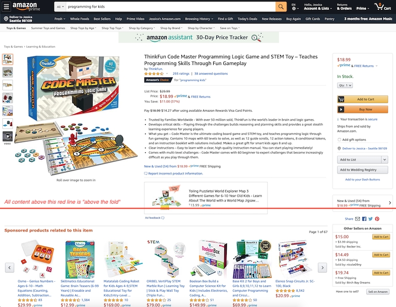

## Mastery Task 2 - Concurrent Tasks

The product detail page team has strict latency requirements for any content rendered “above the fold“, which refers to 
any part of a product detail page that you see when the page first loads without scrolling down.

*Figure 1: Screenshot of an Amazon product detail page, with a red horizontal line across the image to indicate "the 
fold" in "above the fold". We consider any content on the detail page above the red line "above the fold".*

We've been looking at our latency graphs, and we've discovered that our latency increases almost linearly with the
number of `TargetingPredicate`s in a `TargetingGroup`. It's probably because each `TargetingPredicate` calls 
the DAOs it needs on its own.

You recall from the `KindlePublishingService` project that when `RecommendationsService` was slowing us down, you cached 
the calls using an in-memory cache. However, since our service runs on Lambda, our activities can run on
different hosts every time, so any data we save in an in-memory cache will not be there in subsequent calls.

We *have* learned to perform multiple I/O calls at the same time with an `ExecutorService`.
By running all the predicates in a targeting group concurrently,
we can choose an ad quickly enough to meet the latency requirements!

Use an `ExecutorService` to concurrently call the predicates in each group.
You may use a `Future` to store the results, but that's not required.
You also don't have to use lambda expressions, but they will probably make your code more readable.

**Exit Checklist:**

* You've implemented your new functionality with unit tests
* Running the gradle command `./gradlew -q clean :test --tests "com.tct.mastery.task2.*"` passes.
* Running the gradle command `./gradlew -q clean :test --tests com.tct.introspection.MT2IntrospectionTests` passes.
